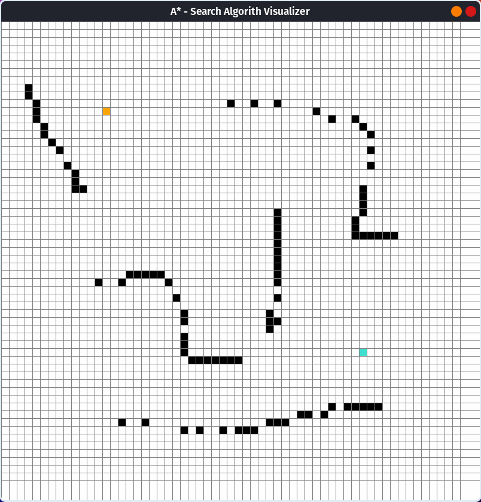
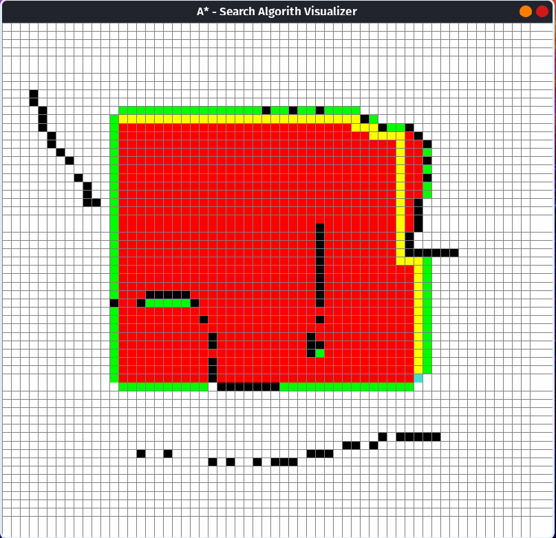

# Asterisk-Search-Algorithm-Visualizer

(  This project is implemented using **Python3** and the library [**pygame**](https://www.pygame.org/news)  )

## General Info

A simple desktop app that shows the workflow of the [__A* Search Algorithm__](https://theory.stanford.edu/~amitp/GameProgramming/AStarComparison.html), which finds the shortest path between two points (_start_ and _end_).

The A* algorithm uses a **[heuristic function](https://theory.stanford.edu/~amitp/GameProgramming/Heuristics.html) h(n)** which tells A* an **_estimate_** of the minimum cost from any vertex n to the goal.

( In this project the **Manhattan distance** is used )

## How to use it ?

1. Clone/Download the repository

2. Execute the main.py file

3. Use the *LEFT-button* on your mouse to choose the positions of the **start-point** (orange color), the **end-point** (turquoise color), and the **obstacles** (black color).
Use the *RIGHT-button* on your mouse to reset your choice for each node/square.

4. Press *SPACE* on your keyboard to start the algorithm: open nodes are in **green**, closed ones are in **red** and the path after the execution of the algorithm is **yellow**.

5. Press *r-key* on your keyboard to reset it to default (a complete white grid).
